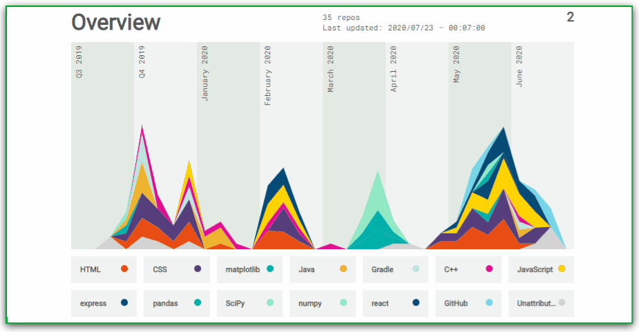

  

  
  
  

###

  

###

<h1 align="center">Hello👋 I'm Mohamed Elshinawy </h1>

###

<h3 align="left">👩‍💻  About Me</h3>

###

I am Mohamed Elshinawy, a committed Computer Science and Artificial Intelligence student passionate about machine learning, algorithms, and problem-solving. Proficient in Python, I thrive on turning theoretical concepts into practical solutions through hands-on projects. Constantly staying abreast of the latest advancements, I bring a proactive problem-solving mindset to the dynamic field of artificial intelligence. Eager to contribute and collaborate, I am poised for opportunities that fuel both personal and professional growth.

###

<h3 align="left">🛠 Language and tools</h3>

###

  
  
  
  
  
  
  
  
  

###

<h3 align="left">🔥   My Stats :</h3>

###

&nbsp;

 
  Visitors count 
  

  

<picture>
  <source media="(prefers-color-scheme: dark)" srcset="https://raw.githubusercontent.com/holic-x/holic-x/output/github-contribution-grid-snake-dark.svg">
  <source media="(prefers-color-scheme: light)" srcset="https://raw.githubusercontent.com/holic-x/holic-x/output/github-contribution-grid-snake.svg">
  
</picture>

  

<h4 align="center">
  <a href="https://github.com/mohamedelshinawy22?tab=repositories" title="Show Repositories">🔎 Show More 🔍</a>
</h4>
